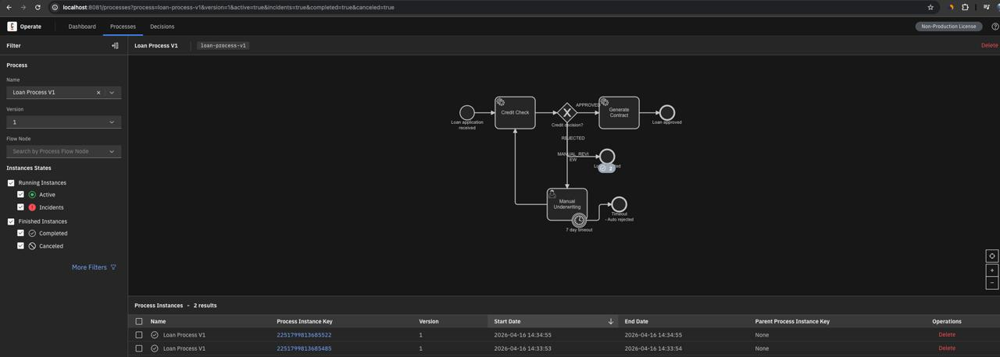
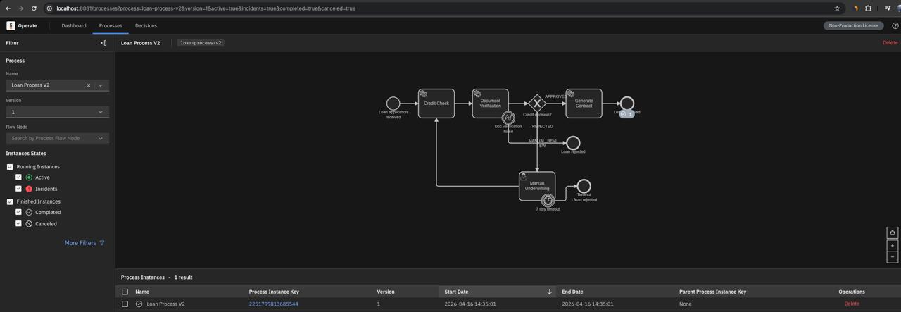
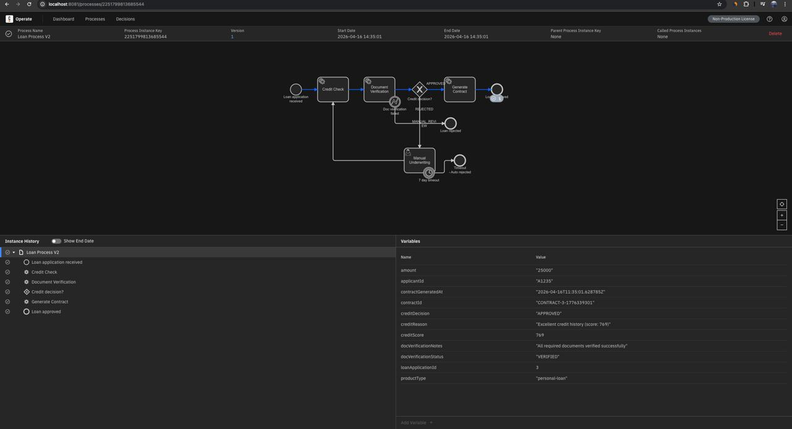
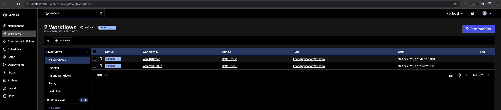
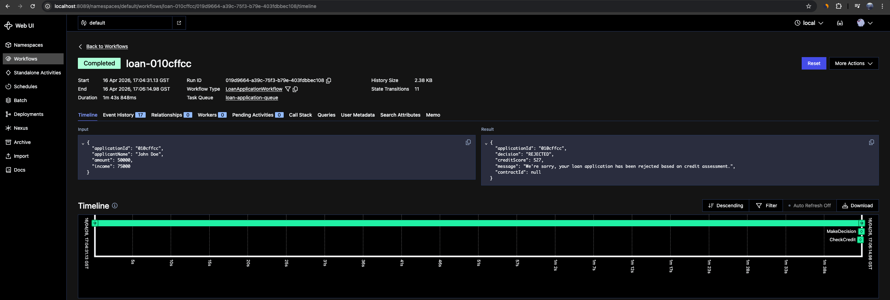

# UI Screenshots: Camunda vs Temporal

This document showcases the user interfaces for both Camunda 8 and Temporal implementations of the loan origination workflow.

---

## Camunda 8 UI

### Camunda Operate - Process Monitoring

**Camunda Operate** provides a comprehensive overview of all running process instances:
- Real-time process monitoring dashboard
- Process instance filtering by status (Active, Completed, Incidents)
- Visual representation of process flow with BPMN diagram
- Direct access to process variables and execution history
- Built-in incident management

---

### BPMN Process Diagram in Operate

The BPMN process diagram in Camunda Operate shows:
- **Visual workflow structure** - See all steps, gateways, and decision points
- **Active process tokens** - Highlighted nodes showing current execution state
- **Execution flow** - Clear visualization of the path taken by each instance
- **Service tasks** - Credit Check, Contract Generation with retry configurations
- **User tasks** - Manual Underwriting with timeout boundary events
- **Gateways** - Decision points for Approved/Rejected/Manual Review routing

Key elements visible in this loan process:
1. Start event
2. Credit Check service task (with 3 retries)
3. Exclusive gateway for decision routing
4. Manual Underwriting user task (with 7-day timeout)
5. Contract Generation service task
6. End events for different outcomes

---

### Process Instance Detail View

The detail view provides:
- **Process instance metadata** - ID, start time, state, version
- **Variable inspector** - Current values of all process variables
  - `loanApplicationId`
  - `applicantId`
  - `creditScore`
  - `creditDecision`
  - Contract details
- **Audit log** - Complete execution history with timestamps
- **Incident management** - If failures occur, they appear here with resolution options
- **Flow navigation** - Step-by-step execution path through the workflow

---

## Temporal UI

### Temporal Web UI - Workflow Execution

**Temporal Web UI** provides a technical view of workflow execution:
- **Workflow execution list** - All running and completed workflows
- **Namespace management** - Logical isolation of different environments
- **Search and filtering** - Query by workflow ID, type, status, time range
- **Event history** - Complete chronological log of all workflow events
- **Execution status** - Running, Completed, Failed, Terminated states
- **Task queue monitoring** - See activity task distribution and worker status

Key features:
- Workflow ID and Run ID for unique identification
- Workflow type (e.g., `LoanApplicationWorkflow`)
- Start and end timestamps
- Current status and result
- Link to detailed event history

---

### Temporal Event History

The event history view shows:
- **Complete event log** - Every action taken by the workflow
  - WorkflowExecutionStarted
  - ActivityTaskScheduled
  - ActivityTaskCompleted
  - TimerStarted (for timeouts)
  - SignalReceived (for manual reviews)
  - WorkflowExecutionCompleted
- **Event details** - Full payload and metadata for each event
- **Input/Output inspection** - See activity inputs and results
- **Deterministic replay** - Events enable time-travel debugging
- **Audit trail** - Perfect record for compliance and troubleshooting

Event types you'll see in the loan workflow:
- **CreditCheckActivity** scheduled and completed with credit score result
- **DecisionActivity** processing the credit decision logic
- **Timer events** for the 7-day manual review timeout
- **Signal events** when underwriter makes a decision
- **ContractGenerationActivity** for approved loans

---

## UI Comparison

### Visual Process Design

| Feature | Camunda Operate | Temporal UI |
|---------|----------------|-------------|
| **Process visualization** | BPMN diagram with real-time tokens | Event history timeline |
| **Business user friendly** | ✅ Yes - visual flow is intuitive | ❌ No - requires technical knowledge |
| **Execution tracking** | Highlighted active nodes | Event list with timestamps |
| **Variable inspection** | Sidebar with current values | Event payload inspection |

### Monitoring & Debugging

| Feature | Camunda Operate | Temporal UI |
|---------|----------------|-------------|
| **Incident management** | ✅ Built-in with retry UI | Activity failures in event log |
| **Process analytics** | ✅ Statistics and heatmaps | Basic metrics (with Prometheus) |
| **User task management** | ✅ Dedicated Tasklist UI | ❌ No - requires custom UI |
| **Time-travel debugging** | ❌ No | ✅ Yes - deterministic replay |

### Operational Features

| Feature | Camunda Operate | Temporal UI |
|---------|----------------|-------------|
| **Manual intervention** | Click to resolve incidents | Requires signals via API |
| **Process modification** | Instance migration tools | Version-based workflow evolution |
| **Forms** | Built-in Camunda Forms | Custom UI required |
| **Search & filter** | Process-specific filters | Workflow query language |

---

## Which UI is Better?

### Choose Camunda Operate if:
- ✅ **Non-technical stakeholders** need to monitor workflows
- ✅ **Visual process representation** is important for your team
- ✅ **Manual incident resolution** through UI is required
- ✅ **User task management** with forms is needed
- ✅ **Business process analytics** are a priority

### Choose Temporal UI if:
- ✅ **Engineering teams** are the primary users
- ✅ **Event-level debugging** is more valuable than visual flows
- ✅ **Perfect audit trail** with replay capability is critical
- ✅ **Technical workflow details** matter more than abstraction
- ✅ **Custom UI development** is acceptable for user tasks

---

## Next Steps

- **See [README.md](README.md)** for full implementation details and comparison
- **See [camunda-loan-poc/](camunda-loan-poc/)** for Camunda setup instructions
- **See [temporal-loan-poc/](temporal-loan-poc/)** for Temporal setup instructions